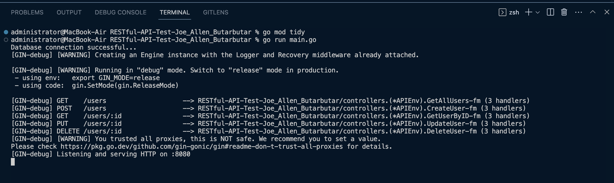

# RESTful-API-Test-Joe_Allen_Butarbutar

How to run:
- Clone this repository
- Setup .env file with your local/engine environment (rename exampe.env to .env)
- Go to directory folder (RESTful-API-Test-Joe_Allen_Butarbutar) and execute command in terminal
    * go mod tidy
    * go run main.go
    
- Hit API url from postman to see the result (payload and methods rest api already provided in postman : RESTful-API-Test-Joe_Allen_Butarbutar.postman_collection.json)
